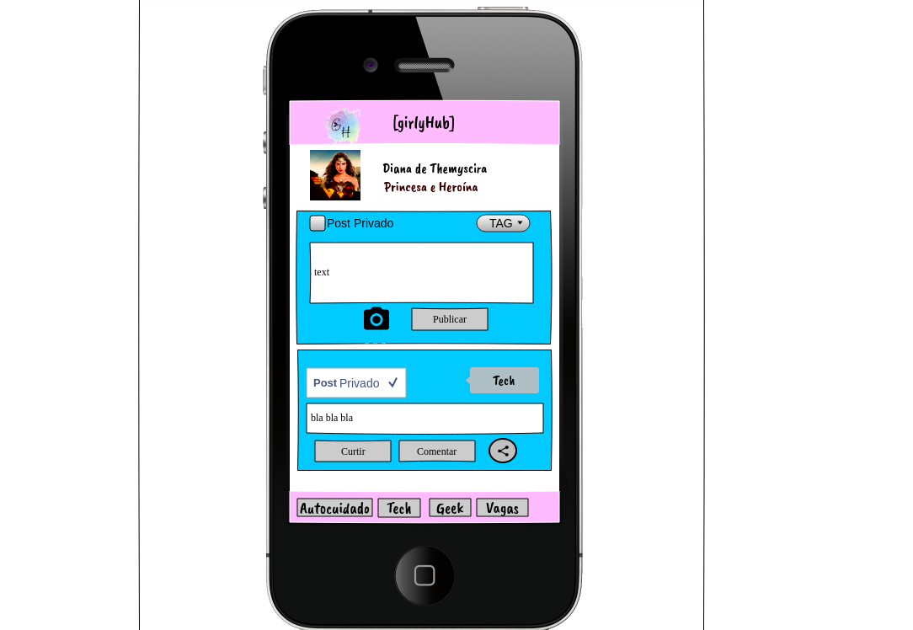

<p align="center">

</p>

<h1 align="center"> [girlyHub] - Social Network</h1>

## Índice

* [1. Apresentação](#1-apresentacao)
* [2. Resumo do projeto](#2-resumo-do-projeto)
* [3. Planejamento](#3-planejamento)
* [4. Funcionalidades](#4-funcionalidades)
* [5. Montagem do ambiente de desenvolvimento](#5-montagem-do-ambiente-de-desenvolvimento)

## 1. Apresentação   

A aplicação consiste na criação de uma Rede Social. Foi desenvolvida em *JavaScript(ES6+)*, juntamente com *HTML5*, *CCS3* e [Firebase](https://firebase.google.com/) Hosting e Firestore para hospedagem e banco de dados.

 A estratégia de desenvolvimento usada foi pair programming, code review e sub-divisão das histórias de usuário.

## 2. Resumo do projeto

A página da aplicação pode ser acessada atraves do Link: [girlyHub](https://social-network-12571.web.app/)

girlyHub é uma rede social, que foi desenvolvida com base nos princípios de sororidade, acolhimento e respeito.

Desejamos criar um ambiente seguro, para pessoas que se identifiquem como gênero feminino, onde possamos trocar conhecimento e apoio que envolvam temas diversos como mundo geek, tecnologia, autocuidado, segurança, oportunidades, entre outros.

As **caraterísticas técnicas** da aplicação são:

* É uma Single-Page Application `SPA` - e foi implementado um sistema de rotas (sem uso de bibliotecas externas) para trocar de uma tela para outra de maneira dinâmica.

* Foi desenhada e desenvolvida com enfoque `mobile first` , e apresenta design responsivo.

* Permite a persistência de dados - a estrutura de dados foi desenhada de forma à consultá-los, atualizá-los, modificá-los e eliminá-los segundo os requerimentos do usuário. Para isto, foi utilizado `Firestore` do `Firebase` 

Recebemos um protótipo desejado para o layout da tela mobile e desktop, onde o tema, conteúdo, funcionalidades extras, cores e fontes de texto foi de nossa escolha.

## 3. Planejamento

Para realizar o nosso planejamento criamos um segundo protótipo para idealização do tema.

<p align="center">

</p>

Foi utilizada a ferramenta trello, para execução do planejamento.

## 4. Funcionalidades

##### Na girlyHub, é possível:

* Cadastro e Login:

> Criar sua conta, com email e senha ao clicar no botão "Criar Agora", sendo redirecionado para uma pagina de registro no primeiro acesso.

> Criar sua conta, com google  ou gitHub.:octocat: 

* Home Page:

> Criar posts com textos e imagens.

> Aplicar a TAG relacionada ao assunto desejado.

> Escolher a privacidade da sua postagem.

> Criar comentários.

> Editar ou excluir a publicação/comentários.

> Curtir publicações e desfazer a ação.

* Outras Funcionalidades:

> Filtrar publicações por TAG e privacidade.

> Editar foto de perfil e capa.

> Incluir ou remover informações na sessão de "perfil".

> Ver orientações e mais informações sobre a girlyHub na sessão "sobre".

## 5. Montagem do ambiente de desenvolvimento

<p align="center">
 
</p>

> :warning: Será necessária a utilização:

 -[Firebase](https://firebase.google.com/products/dynamic-links?gclid=EAIaIQobChMIo9Krk6-W6gIVARKRCh26pgTCEAAYASABEgLr-fD_BwE). :fire::fire::fire: 
 
 -[Node.js](https://nodejs.org/) que contém o [npm](https://docs.npmjs.com/) para instalação das dependências.

 * [Clone](https://help.github.com/articles/cloning-a-repository/) o projeto na sua máquina executando o seguinte comando no seu terminal:
 
-https

``` sh
git clone https://github.com/naereloire/SAP004-social-network.git 
```

* Instale as dependências do projeto com o comando:

``` sh
npm install
```

* Instale e execute o firebase:

``` sh
npm install -g firebase-tools
```

``` sh
firebase login
```

``` sh
firebase init
```

* Para vizualizar no seu local:

``` sh
firebase serve
```

:warning: Neste projeto a regras de [ESLint](https://eslint.org/) estão de acordo com o [Airbnb JavaScript Style Guide](https://github.com/armoucar/javascript-style-guide)

* Para verificar erros do ESLint:

``` sh
npm run pretest
```

**Testes** :clipboard:

* Para executar os testes:

``` sh
npm test
```

**Deploy** :fire:  

* Para executar deploy no firebase hosting:

``` sh
firebase deploy
```

Esse projeto faz parte do currículo do [Bootcamp da Laboratória Brasil](https://www.laboratoria.la/br) 

Desenvolvido por: 

* [Daiane Vieira](https://github.com/daianevieira07)
* [Evellyn Thamires](https://github.com/EvellynThamires)
* [Naere Loire](https://github.com/naereloire)
